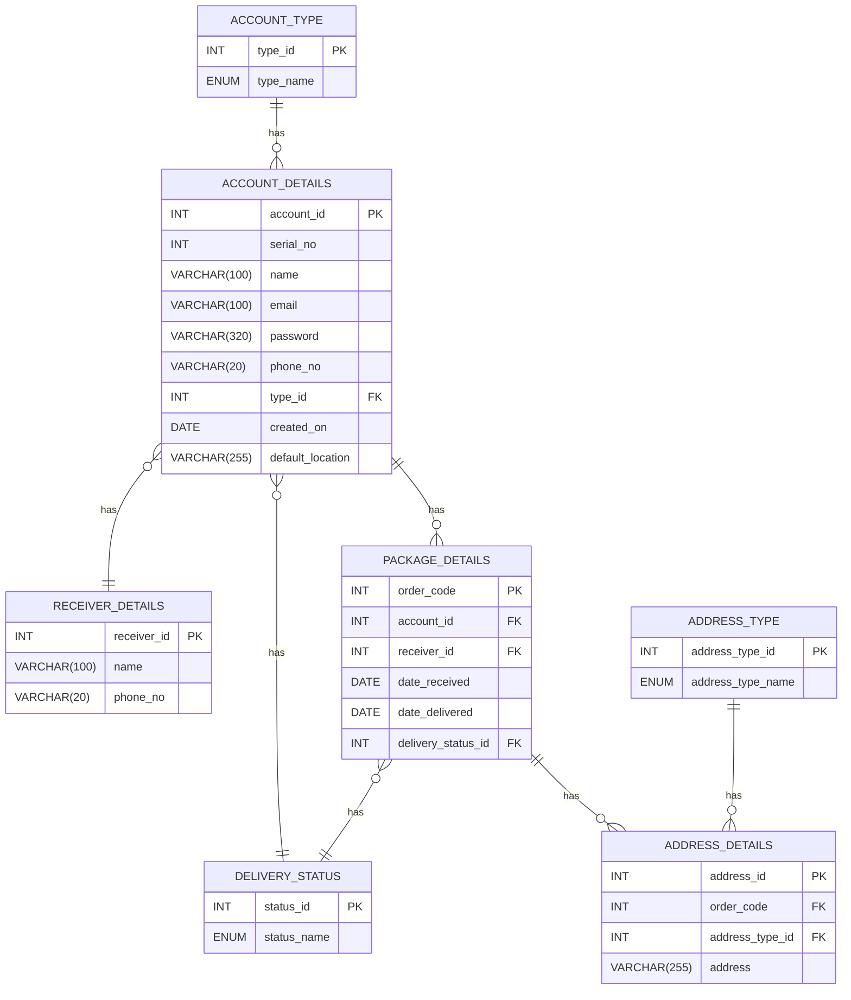

<details>
    <summary>Click to expand/collapse Folder Structure</summary>

I have divided the Code into two folders:
1. New: Contains the new code for the project

    New Folder:
    * Modules: Contains the dependencies installed via npm, including Bootstrap.
    * Images: Holds various images used in the project.
    * HTML: Includes all the HTML files for different pages of the website.
    * Styles: Contains CSS files for styling the website.
    * Database: Holds the SQL file (elitelogisticsdb.sql) for the database structure.
    * PHP: Includes PHP files for server-side functionalities, with index.php located at the root.

    <details>
    <summary>Click to expand/collapse the New Folder Structure</summary>

    ```
    New
    ├── modules
    │   └── node_modules
    │       ├── @popperjs
    │       └── bootstrap
    │           ├── dist
    │           │   ├── css
    |           │   ├── js
    |           │   └── scss
    │           ├── LICENSE
    │           ├── package.json
    │           └── README.md
    ├── images
    |   ├── bannerimg.jpg
    |   ├── call.png
    |   ├── company-img.jpg
    |   ├── deliverycost.png
    |   ├── deliverytime.png
    |   ├── editprofile-bg.jpg
    |   ├── inventory-management.png
    |   ├── last-mile-delivery.png
    |   ├── order-fulfillment.png
    |   ├── reverse-logistics.png
    |   ├── transportation.png
    |   └── warehousing.png
    ├── html
    │   ├── adminDashboard.html
    │   ├── adminDeliveryriders.html
    │   ├── adminPackage.html
    │   ├── adminProfile.html
    │   ├── adminUsers.html
    │   ├── cusDashboard.html
    │   ├── deliveredPackage.html
    │   ├── drDashboard.html
    │   ├── drProfile.html
    │   ├── editProfile.html
    │   ├── index.html
    │   ├── login.html
    │   ├── packageRecords.html
    │   ├── pendingPackage.html
    │   └── signup.html
    ├── styles
    │   ├── adminDashboard.css
    │   ├── adminDeliveryriders.css
    │   ├── adminPackage.css
    │   ├── adminProfile.css
    │   ├── adminUsers.css
    │   ├── cusDashboard.css
    │   ├── drDashboard.css
    │   ├── editProfile.css
    │   ├── index_main.css
    │   ├── login.css
    │   ├── packageRecords.css
    │   ├── signup.css
    │   └── style.css
    ├── database
    │   └── elitelogisticsdb.sql
    └── php
    |   ├── index_main.php
    |   ├── page_footer.php
    |   └── page_header.php
    └── index.php
    ```

    </details>
2. Old: Contains the old code for the project

    Old Folder:

    * Contains the old code for the project. You can keep it for reference or backup purposes.

    <details>
    <summary>Click to expand/collapse the Old Folder Structure</summary>

    ```
    Old
    ├── images
    |   ├── bannerimg.jpg
    |   ├── call.png
    |   ├── company-img.jpg
    |   ├── deliverycost.png
    |   ├── deliverytime.png
    |   ├── editprofile-bg.jpg
    |   ├── inventory-management.png
    |   ├── last-mile-delivery.png
    |   ├── order-fulfillment.png
    |   ├── reverse-logistics.png
    |   ├── transportation.png
    |   └── warehousing.png
    ├── adminDashboard.css
    ├── adminDashboard.html
    ├── adminDeliveryriders.css
    ├── adminDeliveryriders.html
    ├── adminPackage.css
    ├── adminPackage.html
    ├── adminProfile.css
    ├── adminProfile.html
    ├── adminUsers.css
    ├── adminUsers.html
    ├── cusDashboard.css
    ├── cusDashboard.html
    ├── deliveredPackage.html
    ├── drDashboard.css
    ├── drDashboard.html
    ├── drProfile.html
    ├── editProfile.css
    ├── editProfile.html
    ├── index.html
    ├── login.css
    ├── login.html
    ├── packageRecords.css
    ├── packageRecords.html
    ├── pendingPackage.html
    ├── README.MD
    ├── signup.css
    ├── signup.html
    └── style.css
    ```
    </details>
</details>

